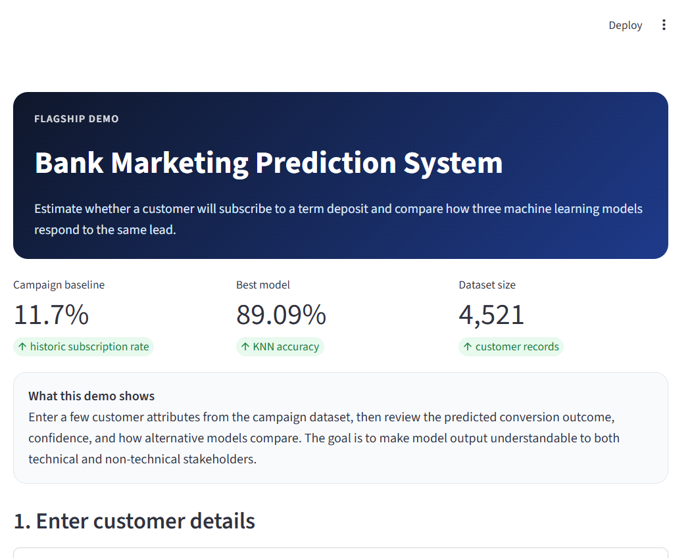
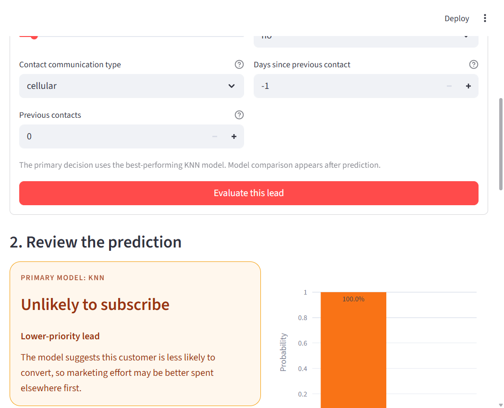
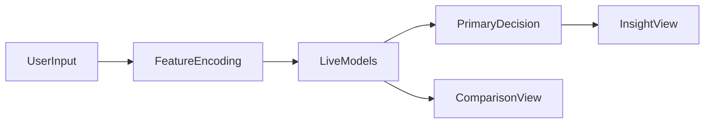

# Bank Marketing Prediction System — Portfolio Case Study

[](https://www.python.org/downloads/)
[](https://streamlit.io/)
[](https://scikit-learn.org/)

> Predict whether a bank customer will subscribe to a term deposit — then package the model so a non-technical reviewer can actually use it.

---

## Why I built this

This started as **COMP615 coursework** at Auckland University of Technology, then became a portfolio iteration. Marketing campaigns are expensive when everyone gets the same outreach. With an **11.7% baseline subscription rate**, even modest targeting improvements matter — but a notebook accuracy score does not help a sales team. I rebuilt the project around **clickable delivery**.

## The challenge

- **Imbalanced classes:** Only ~1 in 9 customers converts — accuracy alone is misleading.
- **Stakeholder readability:** Recruiters and business users need probability, confidence, and a plain recommendation — not a confusion matrix.
- **Beyond the UI:** Real teams score thousands of leads at once; the app had to coexist with batch processing.

## What I did

1. Explored the UCI bank marketing dataset and selected top predictors via ANOVA F-score.
2. Compared KNN, Naive Bayes, and neural network classifiers — **KNN at 89.09%** became the live model.
3. Built a **Streamlit app** (`app.py`) with probability, confidence, and model comparison views.
4. Added **`batch_score.py`** to score CSV files without the UI — the engineering bridge from demo to pipeline.
5. Containerized with **Docker** for repeatable local deployment.

## What I learned

- Deploy something people can **click**, not just notebooks they cannot open.
- On imbalanced data, show **probability and business framing** — not only accuracy.
- `batch_score.py` taught me to decouple inference from presentation — the same pattern used in production ML services.

## How this leveled me up

| | |
|---|---|
| **Before** | I stopped at model comparison tables in Jupyter |
| **After** | I can ship an interactive classifier with batch scoring and Docker |
| **Unlocked next** | Full-stack APIs, warehouse pipelines, and stakeholder-facing analytics dashboards |

## Demo / proof





**Recommended:** run locally (verified working).

```bash
git clone https://github.com/NguyenThuan-data/Bank_Outcome_Prediction_System.git
cd Bank_Outcome_Prediction_System
pip install -r requirements.txt
streamlit run app.py
```

Open [http://localhost:8501](http://localhost:8501).

**Docker:**

```bash
docker build -t bank-predictor .
docker run -p 8501:8501 bank-predictor
```

**Batch scoring:**

```bash
python batch_score.py bank.csv -o scored_leads.csv
```

> **Note:** Hosted Streamlit Cloud is temporarily unavailable. Use local run or Docker for the interactive demo.

---

## Technical reference

### App flow

1. Enter customer attributes from the campaign dataset.
2. Get a predicted outcome from the best live model.
3. Review probability, confidence, and a short business recommendation.
4. Compare the live result with other saved benchmark models.



### Model results

| Model | Accuracy | Live In App | Notes |
| --- | ---: | --- | --- |
| KNN | 89.09% | Yes | Primary decision model |
| Neural Network | 88.05% | Offline benchmark | Wider feature pipeline than live demo form |
| Naive Bayes | 85.41% | Yes | Live comparison model |

### Key features (live demo)

| Feature | Why It Matters |
| --- | --- |
| `duration` | Strongest signal of customer intent |
| `previous` | Prior campaign engagement |
| `contact` | Communication channel differences |
| `housing` | Current financial obligations |
| `pdays` | Recency of previous outreach |

### Tech stack

Python · Streamlit · scikit-learn · Pandas · Plotly · Joblib · Docker

### Repository structure

```text
Bank_Outcome_Prediction_System/
├── Bank_Analysis.ipynb
├── app.py
├── batch_score.py
├── bank.csv
├── knn_model.pkl
├── naive_bayes_model.pkl
├── mlp_model.pkl
├── assets/
├── Dockerfile
└── requirements.txt
```

### Honest notes

- Live demo uses the clearest five-feature prediction path.
- Neural network is retained as offline benchmark — its pipeline expects more inputs than the demo form.
- Strongest as a portfolio piece demonstrating end-to-end ML thinking and communication, not a production banking system.
