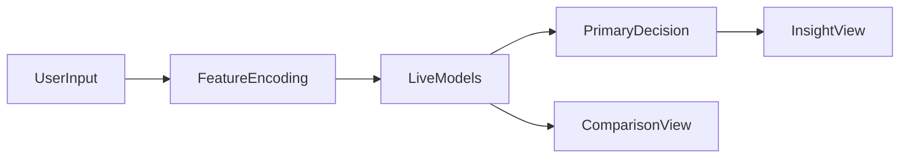

# Bank Marketing Prediction System

[](https://www.python.org/downloads/)
[](https://streamlit.io/)
[](https://scikit-learn.org/)
[](https://plotly.com/)

> Predict whether a bank customer is likely to subscribe to a term deposit, then present that result in a way a recruiter, stakeholder, or non-technical user can understand quickly.

## App Preview


## Why This Project Matters

Marketing campaigns are expensive when sales teams contact everyone the same way. This project reframes that problem into a practical ML workflow:

- identify which customers are more likely to convert
- prioritize outreach using predicted probability
- package the result into an interactive app instead of leaving it inside a notebook

The dataset baseline subscription rate is `11.7%`, so even modest targeting improvements can make outreach more efficient.

## Try The Demo

Live app: [bank-outcome-prediction-system.streamlit.app](https://bank-outcome-prediction-system.streamlit.app/)

If the Streamlit app takes a moment to open, it may be waking up from sleep.

Run locally:

```bash
git clone https://github.com/NguyenThuan-data/Bank_Outcome_Prediction_System.git
cd Bank_Outcome_Prediction_System
pip install -r requirements.txt
streamlit run app.py
```

## What The App Does

The app is designed around a simple recruiter-friendly flow:

1. Enter a few customer attributes from the campaign dataset.
2. Get a predicted outcome from the best live model.
3. Review probability, confidence, and a short business recommendation.
4. Compare the live result with the other saved benchmark models.

## Demo Workflow



## Model Results

| Model | Accuracy | Live In App | Notes |
| --- | ---: | --- | --- |
| KNN | 89.09% | Yes | Primary decision model in the app |
| Neural Network | 88.05% | Offline benchmark | Trained on a wider feature pipeline than the current live demo collects |
| Naive Bayes | 85.41% | Yes | Available as a live comparison model |

## What This Project Demonstrates

### Machine Learning Workflow
- Exploratory analysis and data understanding
- Feature selection using ANOVA F-score
- Classification model comparison across multiple approaches
- Packaging trained models into a usable interface

### Product Thinking
- Translating model output into a simple decision flow
- Presenting probability and confidence instead of only a class label
- Making a technical project understandable to non-technical reviewers

### Engineering Decisions
- Lightweight Streamlit deployment for quick interaction
- Saved model artifacts for repeatable inference
- Cleaner separation between form input, prediction logic, comparison, and insights

## Key Features Used In The Live Demo

The live app uses the five strongest selected predictors from the analysis:

| Feature | Why It Matters |
| --- | --- |
| `duration` | Strongest signal of customer intent |
| `previous` | Indicates prior campaign engagement |
| `contact` | Captures communication channel differences |
| `housing` | Reflects current financial obligations |
| `pdays` | Measures recency of previous outreach |

## Tech Stack

- Python
- Streamlit
- scikit-learn
- Pandas
- Plotly
- Joblib
- Jupyter Notebook

## Repository Structure

```text
Bank_Outcome_Prediction_System/
├── Bank_Analysis.ipynb
├── Bank_Analysis.pdf
├── app.py
├── bank.csv
├── knn_model.pkl
├── mlp_model.pkl
├── naive_bayes_model.pkl
├── model_info.pkl
├── assets/
│   └── bank_predict.png
├── requirements.txt
└── README.md
```

## Honest Notes

- The live demo is intentionally focused on the clearest five-feature prediction path.
- The neural network result is retained as an offline benchmark, but its training pipeline expects more inputs than the current demo form collects.
- This repo is strongest as a portfolio project that demonstrates end-to-end ML thinking, deployment, and communication, rather than a full production banking system.

## Academic Context

This project was originally developed from coursework in `COMP615 - Foundation of Data Science` at Auckland University of Technology, then improved into a more complete portfolio piece with a live app and stronger presentation.

